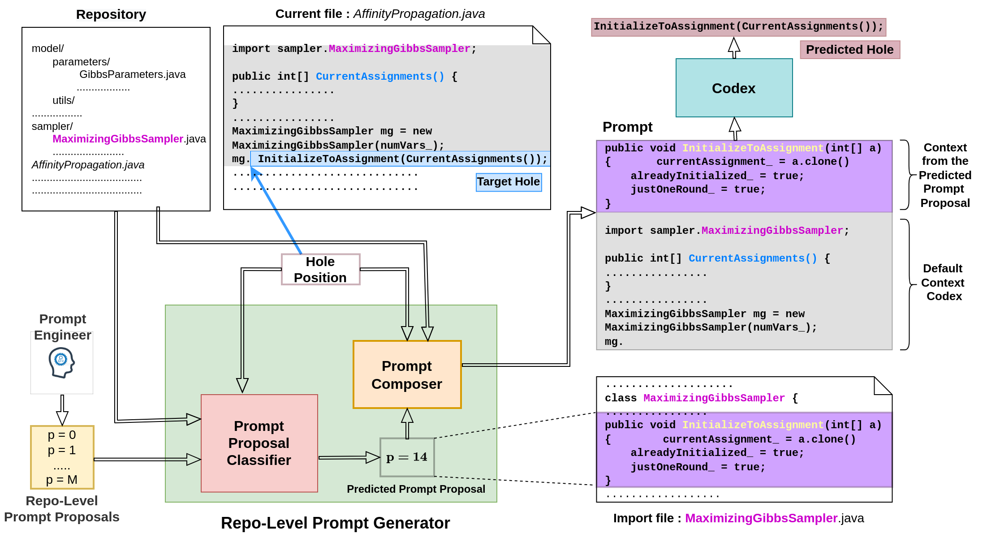

## Repository-Level Prompt Generation for Large Language Models of Code
Disha Shrivastava, Hugo Larochelle, Daniel Tarlow

This repository contains implementation and data for our work [Repository-Level Prompt Generation for Large Language Models of Code](). A block diagram of our approach can be found below. For more details, refer to the paper.

 

## Dependencies
* Access to OpenAI Codex API: https://openai.com/blog/openai-codex/. The key should be placed in a file named `openai_api_key`
* pytorch: https://pytorch.org/
* Huggingface's transformers: https://pypi.org/project/transformers/
* tree-sitter-java: https://github.com/tree-sitter/tree-sitter-java
* tqdm
* tensorboard 
 
## Code
### Data preprocessing
The web URLs for all the repositories used in our work is provided in <ins>projects.txt</ins>. Download and store them in a folder called <ins>gcode-data</ins>. Then run `script_gen_and_preprocess_data.py`. This script will produce an output file called <ins>commands_gen_and_preprocess</ins>. Running it will execute three scripts:
 - `create_sample_data.py`: creates the hole completion data by choosing the midpoint of each line as hole position.
 - `parse_tree.py`: creates a parse tree for each file as well as store repo-level meta-info needed to get rule-context.
 - `check_duplication.py`: check for duplicates within a repo.
Running this will create a new folder called rule_classifier_data that has train, val and test subfolders. Inside each folder, we will have a folder for a repository that will contain the following:

      * The repository with .java files and preserving the directory structure.
      * hole_data
      * file_class_data
      * parsed_data
      * duplicates

### Generating completions using Codex, i.e., obtaining the ground-truth for training the rule classifier.
`script_completions.py`
Generates a file <ins>commands_completion</ins>. Running this will create a new folder called results that has train, val and test subfolders. Inside each folder, we will have the ten folders corresponding to rule context locations. Each folder contains .json files corresponding to rule context types. Each row of the file contains data about the application of that particular rule to a hole. It stores the target hole, predicted hole, the prompt and the validity of the rule.

### Generating the oracle
`script_analyze_results.py`
Generates a file <ins>commands_analyze_results</ins>. Running this file will create a file called <ins>oracle</ins> inside each repo in rule_classifier_data. This file contains the collated information about the success of each rule for a particular target hole.

### Generating the rule context representations for the rule classifier
`generate_rule_representations.py`

Example usage: `python generate_rule_representations.py --data_split=val --repo=jata4test --emb_model_type=codebert`

This will lead to creation of <ins>codebert_mod</ins> folder inside the path rule_classifier_data/val/jata4test. Each file in this folder contains the rule context representation obtained from codebert for each hole.

### Capping the number of holes
`rearrange_data.py`
This script will cap the maximum contribution from a repo to 10000 holes. After this, each repo folder will contain files <ins>capped_holes_10000</ins>, <ins>capped_codebert_mod</ins> and <ins>capped_oracle_10000</ins>.

### Training the rule classiifer
`rule_classifier_preprocessed_data.py`
This needs the capped_codebert_mod folder (rule context representations) to be present inside each repo folder as well as capped_oracle_10000 file.
The best model is stored in models directory along with the tensorboard logs. The output from each epoch is stored in the outputs folder.

### Inference with the rule classifier
`rule_inference_preprocessed_data.py`
This needs the capped_codebert_mod folder (rule context representations) to be present inside each repo folder as well as capped_oracle_10000 file.
This produces a file inside the outputs folder that contains the prediction of the classifier for each hole.

### Getting results for variation with k
`get_info_from_predictions.py`
This needs a <ins>hole_stats_file</ins> as input (generated from the previous step) and a value of k.
